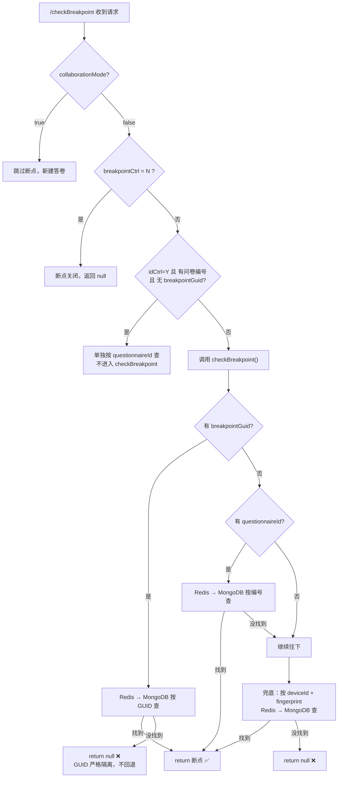

<br />

> 答卷过程中每答一题自动存盘，刷新/断网/换设备后恢复进度，支持设备指纹 + GUID + 问卷编号三种身份识别。


## 💡 背景

在线问卷答题时间可能长达 30 分钟以上，期间可能发生：浏览器刷新、网络断开、手机息屏、甚至换设备继续答。断点机制的核心价值：

- 答到一半不丢数据，刷新后恢复到上次答到的题目
- 支持多种身份识别方式（设备指纹、GUID、问卷编号）
- 每答一题自动存盘，无需用户手动保存
- 断点 7 天有效，过期自动清理


## 🏗️ 整体流程

```
答题页面加载
  │
  ├─ ① 前端调用 /checkBreakpoint
  │    → 是否找到断点？
  │       ├─ 有 → 加载断点数据，跳到上次答到的题目
  │       └─ 无 → 走 initAnswer 初始化新答卷
  │
  ├─ ② 每答一题，前端调用 /saveAnswer
  │    → 后端更新 MongoDB + 同步更新 Redis 断点缓存
  │
  ├─ ③ 答题完成（status=done/out/stop）
  │    → 清空该答卷的断点缓存
  │
  └─ ④ 断点过期（7 天后）
       → Redis TTL 自动删除
```


## 🔑 三种身份识别方式

断点根据谁在答题来恢复，支持三种身份维度的组合：

| 维度   | 字段                               | 来源     | 适用场景         |
| ---- | -------------------------------- | ------ | ------------ |
| 设备指纹 | `deviceId` + `deviceFingerprint` | 浏览器生成  | 普通用户刷新/断网    |
| GUID | `breakpointGuid`                 | 问卷链接参数 | 唯一身份码（第三方投递） |
| 问卷编号 | `questionnaireId`                | 作答时录入  | 有问卷编号控制的场景   |

### 优先级逻辑



> 关键点：GUID 一旦传入且未命中，直接 return null，**不会回退到 deviceId 或 questionnaireId**。GUID 模式是严格隔离的。


## 📡 API 接口

### 1. 检查断点

```
GET /checkBreakpoint
```

| 参数                | 必填 | 说明              |
| ----------------- | -- | --------------- |
| projectId         | ✅  | 项目 ID           |
| version           | ✅  | 问卷版本号           |
| deviceId          | ❌  | 设备 ID           |
| deviceFingerprint | ❌  | 设备指纹            |
| breakpointGuid    | ❌  | 第三方 GUID        |
| questionnaireId   | ❌  | 问卷编号            |
| collaborationMode | ❌  | 协作模式，true 则跳过断点 |

返回 `BreakpointResponseDTO`：`{ hasBreakpoint, answerId, currentQuestionNo, breakpointData }`。

### 2. 保存断点

```
POST /saveBreakpoint
```

| 参数                | 必填 | 说明     |
| ----------------- | -- | ------ |
| answerId          | ✅  | 答卷 ID  |
| currentQuestionNo | ✅  | 当前题目编号 |

> 实际保存逻辑嵌入在 `/saveAnswer` 中：每答一题写入 MongoDB 的同时，自动更新 Redis 断点缓存。

### 3. 清除断点

```
POST /clearBreakpoint?answerId=xxx
```

答卷完成/被甄别/中断后调用，删除该答卷的所有断点缓存。

### 4. 重置断点

```
POST /resetBreakpoint
```

| 参数              | 必填 | 说明             |
| --------------- | -- | -------------- |
| projectId       | ✅  | 项目 ID          |
| deviceId        | ❌  | 设备 ID（按设备清）    |
| version         | ❌  | 版本号            |
| questionnaireId | ❌  | 问卷编号（按编号清）     |
| breakpointGuid  | ❌  | GUID（按 GUID 清） |


## 🗄️ 数据存储

### Redis（断点缓存）

**存储结构**：`JSON 字符串`，序列化整个 `ProjectAnswer` 对象。

**Key 规则**（三种模式）：

| 模式   | Key 格式                                                                    | 示例                                             |
| ---- | ------------------------------------------------------------------------- | ---------------------------------------------- |
| 设备指纹 | `survey:breakpoint:{projectId}:{version}:device:{deviceId}:{fingerprint}` | `survey:breakpoint:123:5:device:abc:xyz123`    |
| 问卷编号 | `survey:breakpoint:{projectId}:{version}:questionnaireId:{id}`            | `survey:breakpoint:123:5:questionnaireId:Q001` |
| GUID | `survey:breakpoint:{projectId}:{version}:guid:{breakpointGuid}`           | `survey:breakpoint:123:5:guid:GUID-xxx`        |

**过期时间**：统一 7 天（`BREAKPOINT_EXPIRE_DAYS = 7`），三种身份维度不区分，全部一样

**序列化**：使用 Jackson `ObjectMapper`，启用多态类型处理以正确序列化 `Answer` 子类（如 `TextAnswer`、`RadioAnswer` 等）。

```java
// BreakpointCacheManager — 核心存取逻辑
public void save(ProjectAnswer answer) {
    String key = generateKey(answer);
    String json = objectMapper.writeValueAsString(answer);
    redisTemplate.opsForValue().set(key, json, 7, TimeUnit.DAYS);
}

public ProjectAnswer get(String key) {
    String json = (String) redisTemplate.opsForValue().get(key);
    return objectMapper.readValue(json, ProjectAnswer.class);
}

public void delete(String key) {
    redisTemplate.delete(key);
}
```

### MongoDB（持久化答案）

断点缓存是 Redis 快照，完整答案数据持久化在 MongoDB 的 `projects_answer` 集合中。

- 每次 `saveAnswer` 操作同时更新 MongoDB + Redis
- Redis 过期后，数据仍在 MongoDB 中（用于数据分析和导出）
- 断点恢复优先查 Redis（快），Redis miss 时回退查 MongoDB（兜底）


## 🔗 生命周期

```
initAnswer
  │  createTime = now, status = "active"
  │  breakpointExpireTime = now + 7天
  │
  ├─ 每次 saveAnswer → Redis 断点缓存更新
  │
  ├─ status = "done"  → clearBreakpoint() → 删除所有维度断点缓存
  ├─ status = "out"   → clearBreakpoint()
  ├─ status = "stop"  → clearBreakpoint()
  │
  └─ 7 天后 → Redis TTL 自动过期
```

> 断点只对 `active` 状态有效。已完成/被甄别/中断的答卷不再保留断点。


## 🔧 断点开关控制

生成问卷链接时，`tags` 字段 JSON 中可配置：

```json
{
    "breakpointCtrl": "N",   // "N" = 关闭断点，"Y" 或不填 = 开启
    "idCtrl": "Y",           // "Y" = 开启问卷编号控制
    "guidCtrl": "Y"          // "Y" = 开启 GUID 投递
}
```

### 三种控制组合的效果

| breakpointCtrl | idCtrl | guidCtrl | 行为                    |
| -------------- | ------ | -------- | --------------------- |
| Y / 不填         | —      | —        | 断点正常启用                |
| N              | —      | —        | 断点关闭，每次都是新答卷          |
| Y              | Y      | N        | 按 questionnaireId 恢复  |
| Y              | —      | Y        | 第三方 GUID 投递，按 GUID 恢复 |


## ⭐ 设计要点总结

1. **Redis + MongoDB 双写**：Redis 保证读取速度（ms 级），MongoDB 保证数据持久性
2. **三种身份维度**：device / questionnaireId / GUID，覆盖所有使用场景，优先级由 tags 控制
3. **自动清理**：答卷完成即删除缓存，过期自动 TTL，不堆积垃圾数据
4. **答一存一**：`saveAnswer` 自带断点同步，无额外接口调用开销
5. **可配置开关**：`breakpointCtrl` 一行配置决定断点是否生效，灵活关闭
6. **7 天有效期**：足够覆盖大多数问卷投放周期，过期自动回收 Redis 内存


